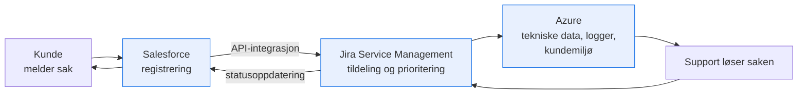

# 01 — Virksomhetskontekst

| | |
|---|---|
| **Dokument** | Virksomhets- og systemkontekst for Mjøsdata AS |
| **Dokumenteier** | Sikkerhetsansvarlig |
| **Godkjent av** | Daglig leder |
| **Versjon** | 2.0 · Gjeldende fra 01.09.2026 · Revideres årlig |
| **Hjemmel** | ISO/IEC 27001:2022 pkt. 4.1–4.3 (organisasjonens kontekst, interessenters behov, omfang) |
| **Leser videre** | [02 Risikovurdering](../02-risikovurdering/metodikk.md) · [03 GDPR](../03-gdpr/gdpr-analyse.md) · [06 NIS2](../06-nis2/nis2-vurdering.md) |

> Dette dokumentet etablerer forretnings- og systemkonteksten som all senere analyse hviler på. ISO/IEC 27001 krever at organisasjonen forstår seg selv og sine interessenter *før* omfang og risiko fastsettes (pkt. 4.1–4.3) — rekkefølgen er ikke tilfeldig: et risikobilde uten forretningskontekst blir en liste over tekniske svakheter, ikke en beslutningsstøtte.

---

## 1. Om virksomheten

Mjøsdata AS er en IT-driftsleverandør (managed service provider, MSP) med hovedkontor i Hamar og 45 ansatte fordelt på konsulenter, driftspersonell, support, salg og administrasjon. Selskapet leverer IT-drift, skytjenester og sikkerhetstjenester til små og mellomstore virksomheter i Innlandet.

| Kundesegment | Typiske kunder | Hva som gjør segmentet krevende |
|---|---|---|
| **Profesjonelle tjenesteytere** | Advokatkontorer, regnskapsbyråer | Lovpålagt taushetsplikt; klientdata er konkurransesensitive |
| **Helsevirksomheter** | Private helseklinikker, tannlegekontorer | Særlige kategorier av personopplysninger (GDPR art. 9); pasientjournalloven |
| **Offentlig sektor** | Kommuner, skoler | Anskaffelsesregler, forvaltningskrav, høye krav til oppetid |

Hoveddelen av omsetningen er abonnementsbasert drift og support med tjenestenivåavtaler (SLA). Det gjør **tilgjengelighet** til en direkte kommersiell forpliktelse, ikke bare en teknisk ambisjon: brudd på SLA utløser avtalefestet prisavslag og hever risikoen for kundeflukt ved neste fornyelse.

---

## 2. Digital verdikjede

Tre systemer bærer kjerneprosessene:

| System | Rolle | Sentrale informasjonsverdier | Mjøsdatas GDPR-rolle |
|---|---|---|---|
| **Salesforce (CRM)** | Kundeinformasjon, kontrakter, salgsoppfølging, registrering av supporthenvendelser | Kundedata, kontraktsvilkår, kontakthistorikk | Behandlingsansvarlig |
| **Jira Service Management** | Automatisert tildeling, prioritering og sporing av supportsaker | Supportlogger, feilbeskrivelser (kan inneholde personopplysninger) | Behandlingsansvarlig / databehandler¹ |
| **Microsoft Azure** | Skyplattform for kundemiljøer og intern databehandling; lagring, virtuelle maskiner, backup | Tekniske konfigurasjoner, kundedata i drift, sikkerhetskopier | Databehandler |

¹ Rollen avhenger av om saken gjelder Mjøsdatas eget kundeforhold eller behandling utført på kundens vegne. Se [rolleanalysen i kap. 03](../03-gdpr/gdpr-analyse.md#1-rolleanalyse-behandlingsansvarlig-eller-databehandler).

### Kjerneprosess: kundesupporthåndtering

1. Kunden melder inn en sak → registreres i **Salesforce** med kontaktinformasjon og problembeskrivelse
2. Saken overføres via API-integrasjon til **Jira Service Management**, som tildeler den automatisk etter prioritet og kompetanse
3. Supportteamet henter tekniske data (konfigurasjoner, logger) fra **Azure**, analyserer og løser saken
4. Løsningen registreres i Jira, status oppdateres i Salesforce, og kunden får tilbakemelding

Dataflyten krysser tre systemer og én API-integrasjon. Hvert overgangspunkt er både en potensiell angrepsflate og et sted der data kan gå tapt eller forvanskes — API-integrasjonen behandles eksplisitt som [R3 i risikoregisteret](../02-risikovurdering/risikoregister.md).

---

## 3. Hvorfor informasjonssikkerhet er forretningskritisk

KIT-egenskapene (konfidensialitet, integritet, tilgjengelighet) er ikke abstrakte prinsipper for Mjøsdata — de tilsvarer konkrete kommersielle og rettslige forpliktelser:

- **Konfidensialitet** — Klientdata fra advokatkontorer og helseklinikker er underlagt henholdsvis taushetsplikt og GDPR art. 9. En lekkasje rammer ikke bare Mjøsdata, men utløser kundens egne rettslige forpliktelser. MSP-er er attraktive mål nettopp fordi ett innbrudd gir tilgang til mange virksomheter samtidig (leverandørkjedeangrep) — det strukturelle problemet som driver [R6 og R8](../02-risikovurdering/risikoregister.md).
- **Integritet** — Feil i supportlogger eller kundekonfigurasjoner kan gi driftsstans hos kunder og svekke bevisverdien av logger ved hendelser. Uten pålitelige logger blir en hendelsesetterforskning gjetning.
- **Tilgjengelighet** — 24/7-helpdesk og drift av tidskritiske kommunale systemer er kontraktsfestet gjennom SLA-er med oppetidsgaranti og responstidskrav. Nedetid konverteres direkte til penger.

**Konsekvensen for risikovurderingen:** fordi Mjøsdata bærer risiko på vegne av mange kunder samtidig, ligger konsekvensnivåene systematisk høyere enn de ville gjort for en enkeltstående virksomhet av samme størrelse. Dette er begrunnet eksplisitt i [konsekvensskalaen](../02-risikovurdering/metodikk.md#3-konsekvensskala).

---

## 4. Interessenter og krav (ISO 27001 pkt. 4.2)

| Interessent | Krav/forventning | Kilde | Status |
|---|---|---|---|
| Kunder (helse) | Vern av helseopplysninger, databehandleravtale, bistand ved DPIA | GDPR art. 9, 28, 32; pasientjournalloven; personopplysningsloven | Delvis dekket — se [kap. 03](../03-gdpr/gdpr-analyse.md) |
| Kunder (advokat/regnskap) | Konfidensialitet, taushetsplikt i leverandørleddet | Advokatforskriften, bokføringsloven; avtale | Delvis dekket |
| Kunder (kommuner) | Oppetid, forsvarlig informasjonssikkerhet, dokumenterbar etterlevelse | SLA; eForvaltningsforskriften; anskaffelseskrav | Delvis dekket |
| Datatilsynet | Etterlevelse av GDPR, meldeplikt ved brudd | GDPR art. 33–34; personopplysningsloven | Gap — se [T8](../02-risikovurdering/tiltaksplan.md#t8--hendelsesrespons--og-bruddrutiner) |
| NSM / sektormyndighet | Grunnleggende sikkerhetsnivå. Mjøsdata er **ikke** pliktsubjekt etter gjeldende digitalsikkerhetslov, men kan bli det når NIS2 gjennomføres i norsk rett | NSM Grunnprinsipper for IKT-sikkerhet 2.1 (anbefaling); NIS2 (under EØS-vurdering) — se [kap. 06](../06-nis2/nis2-vurdering.md) | Under overvåking |
| Underleverandører | Databehandleravtaler, sikkerhetskrav i avtale | GDPR art. 28; ISO 27001 A.5.19–A.5.23 | Gap — se [T10](../02-risikovurdering/tiltaksplan.md#t10--leverandør--og-verktøykjedestyring) |
| Eiere/ledelse | Lønnsomhet, omdømme, dokumentert risikokontroll | Styrevedtak; NIS2 vil skjerpe ledelsesansvaret | Etablert i [styringsmodellen](../02-risikovurdering/tiltaksplan.md#styring-og-oppfølging) |

> **Presisering om regelverk:** Gjeldende norsk digitalsikkerhetslov gjennomfører NIS1 og retter seg mot tilbydere av samfunnsviktige tjenester og enkelte digitale tjenestetilbydere. En MSP av Mjøsdatas type omfattes etter alt å dømme **ikke** i dag. NIS2 — som uttrykkelig navngir MSP-er — er ennå ikke innlemmet i EØS-avtalen og gjennomført i norsk rett. Alle henvisninger til NIS2-plikter i denne porteføljen er derfor **forberedende, ikke gjeldende rett**. Se [kap. 06](../06-nis2/nis2-vurdering.md) for den fulle vurderingen.

---

## 5. Omfang og avgrensning (ISO 27001 pkt. 4.3)

**Innenfor omfang:** kjerneprosessen kundesupporthåndtering, de tre bærende systemene (Salesforce, Jira Service Management, Azure), API-integrasjonen mellom dem, identitets- og tilgangsstyring på tvers, samt endepunktene som brukes av support- og driftspersonell.

**Utenfor omfang:** interne støtteprosesser (HR, økonomi) og fysisk sikring av hovedkontoret berøres kun der de påvirker kjerneprosessen — for eksempel offboarding-rutinen, som er en HR-prosess med direkte sikkerhetseffekt og derfor er tatt inn i [tilgangsstyringspolicyen](../04-isms/policy-tilgangsstyring.md#33-livssyklus).

**Begrunnelse for avgrensningen:** kundesupportprosessen er der Mjøsdata både tjener pengene sine og bærer størst risiko på vegne av andre. Å begrense omfanget gir en analyse som faktisk kan gjennomføres og forsvares, framfor en overflatisk gjennomgang av hele virksomheten. Utvidelse til øvrige prosesser er en planlagt neste iterasjon.

---

## 6. Kilder

- ISO/IEC 27001:2022 — *Information security management systems* (pkt. 4.1–4.3)
- NSM: *Grunnprinsipper for IKT-sikkerhet 2.1*
- Datatilsynet: veiledere om behandlingsansvarlig og databehandler
- Lov om digital sikkerhet (digitalsikkerhetsloven) — gjennomfører NIS1
