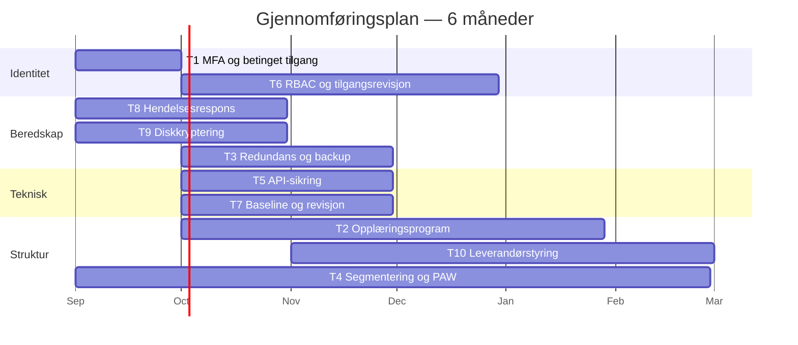

# 02.3 — Risikobehandlingsplan

| | |
|---|---|
| **Dokument** | Risikobehandlingsplan (risk treatment plan) |
| **Dokumenteier** | Sikkerhetsansvarlig |
| **Godkjent av** | Daglig leder |
| **Versjon** | 2.0 · Gjeldende fra 01.09.2026 · Følges opp kvartalsvis |
| **Hjemmel** | ISO/IEC 27001:2022 pkt. 6.1.3; ISO/IEC 27005:2022 |
| **Leser videre** | [Risikoregister](risikoregister.md) · [Statement of Applicability](../04-isms/statement-of-applicability.md) · [Sporbarhetsmatrise](../sporbarhetsmatrise.md) |

> **Omfang.** Planen dekker alle risikoer over akseptnivå (nivå ≥ 10: R1, R2, R3, R4, R6, R8, R10) **samt** tre moderate risikoer der tiltakskostnaden er så lav at det ikke er forsvarlig å utsette dem (R5, R7, R9). Akseptkriteriene i [metodikk pkt. 4](metodikk.md#4-risikoakseptkriterier) åpner uttrykkelig for dette.
>
> **Om restrisiko.** Restrisiko er oppgitt som et nytt **S×K-par** med begrunnelse for hvilken av de to faktorene tiltaket faktisk endrer. Et tiltak som bare oppgis som «12 → 4» skjuler om det virker forebyggende eller skadebegrensende, og lar seg ikke etterprøve.

---

## Oversikt

| # | Tiltak | Adresserer | Kostnad | Frist | Prioritet |
|:---:|---|---|---|:---:|:---:|
| [T1](#t1--obligatorisk-phishing-resistent-mfa-og-betinget-tilgang) | Phishing-resistent MFA og betinget tilgang | R1, R2, R8 | Lav | 1 mnd | 1 |
| [T8](#t8--hendelsesrespons--og-bruddrutiner) | Hendelsesrespons- og bruddrutiner | R9 + alle | Lav | 2 mnd | 2 |
| [T9](#t9--full-diskkryptering-og-endepunktkontroll) | Full diskkryptering og endepunktkontroll | R7 | Lav | 2 mnd | 3 |
| [T2](#t2--kontinuerlig-sikkerhetsopplæring-med-phishing-simulering) | Sikkerhetsopplæring og phishing-simulering | R2, R5, R9 | Lav–moderat | 2 mnd (oppstart) | 4 |
| [T5](#t5--sikring-av-api-integrasjoner) | Sikring av API-integrasjoner | R3 | Moderat | 3 mnd | 5 |
| [T7](#t7--baseline-konfigurasjon-og-teknisk-revisjon-av-azure) | Baseline-konfigurasjon og teknisk revisjon | R10, R6 | Moderat | 3 mnd | 6 |
| [T3](#t3--geo-redundans-immutable-backup-og-ddos-beskyttelse) | Geo-redundans, immutable backup, DDoS-vern | R4, R6 | Høy | 3 mnd | 7 |
| [T6](#t6--rollebasert-tilgangsstyring-og-periodisk-tilgangsrevisjon) | Rollebasert tilgangsstyring og tilgangsrevisjon | R5, R1 | Moderat | 4 mnd | 8 |
| [T10](#t10--leverandør--og-verktøykjedestyring) | Leverandør- og verktøykjedestyring | R8 | Lav–moderat | 6 mnd | 9 |
| [T4](#t4--segmentering-og-herding-av-msp-verktøykjeden) | Segmentering og herding av MSP-verktøykjeden | R6, R8, R2 | Høy | 6 mnd | 10* |

\* T4 rangeres sist på risikoreduksjon per krone, men startes **parallelt fra dag én**. Se [kost/nytte](#kostnytte-og-prioritering).

---

## Tiltak

### T1 — Obligatorisk phishing-resistent MFA og betinget tilgang

**Adresserer:** R1, R2, delvis R8

- **Tiltak:** Håndheve MFA for alle brukere i Salesforce, Jira, Azure og e-post via Entra ID Conditional Access. Prioritere phishing-resistente metoder (FIDO2/passkeys) for administratorer og supportteam. Blokkere legacy-autentisering som ikke støtter MFA.
- **Begrunnelse:** Kontoovertakelse er inngangsvektoren i begge de to høyest rangerte risikoene. Sterk autentisering fjerner ikke angrepsforsøket, men bryter angrepskjeden på det punktet der den er billigst å bryte. Lisensene finnes i all hovedsak allerede i Microsoft 365-avtalen — dette er planens høyeste risikoreduksjon per krone.
- **Kontroller:** ISO 27001 `A.5.17` (autentiseringsinformasjon), `A.8.5` (sikker autentisering) · NSM GP **2.6** (ha kontroll på identiteter og tilganger)
- **Eier:** Driftsansvarlig · **Frist:** 1 måned

| Risiko | Før | Etter | Endring |
|---|---|---|---|
| R1 | S4 × K4 = **16** 🔴 | S1 × K4 = **4** 🟢 | Sannsynlighet 4 → 1. Konsekvensen er uendret: lykkes angrepet, er dataene like eksponerte |
| R2 | S4 × K5 = **20** 🔴 | S2 × K5 = **10** 🟠 | Sannsynlighet 4 → 2. Krever [T2](#t2--kontinuerlig-sikkerhetsopplæring-med-phishing-simulering) og [T4](#t4--segmentering-og-herding-av-msp-verktøykjeden) for å nå akseptabelt nivå |

---

### T2 — Kontinuerlig sikkerhetsopplæring med phishing-simulering

**Adresserer:** R2, R5, R9

- **Tiltak:** Programmet beskrevet i [kap. 05](../05-sikkerhetskultur/opplaeringsprogram.md): kvartalsvise interaktive kurs, månedlige phishing-simuleringer med support som prioritert målgruppe, og en atferdskampanje som belønner rapportering. Målsatt klikkrate < 5 % og rapporteringsrate > 60 % innen 12 måneder.
- **Begrunnelse:** MFA ([T1](#t1--obligatorisk-phishing-resistent-mfa-og-betinget-tilgang)) stopper kontoovertakelse, men ikke sosial manipulering som får en ansatt til å utføre handlingen selv. Support er den eksponerte gruppen: høyt e-postvolum, tidspress og bred systemtilgang i samme rolle.
- **Kontroller:** ISO 27001 `A.6.3` (bevisstgjøring, utdanning og opplæring) · NSM GP **2.8** (beskytt e-post og nettleser) for de tekniske delene
- **Merknad om rammeverk:** NSMs *Grunnprinsipper for IKT-sikkerhet* har ingen egen prinsippkategori for opplæring og sikkerhetskultur — det dekkes av NSMs *Grunnprinsipper for sikkerhetsstyring* («Gjennomfør jevnlige øvelser, trening og opplæring»). Referansen er derfor delt mellom to NSM-rammeverk framfor å tvinges inn i ett.
- **Eier:** Sikkerhetsansvarlig · **Frist:** oppstart innen 2 måneder, full syklus løpende

| Risiko | Før | Etter (med T1 og T4) | Endring |
|---|---|---|---|
| R2 | S2 × K5 = **10** 🟠 | S2 × K4 = **8** 🟡 | Konsekvens 5 → 4. Opplæring reduserer ikke antall phishing-forsøk, men rask rapportering forkorter tiden angriperen er uoppdaget, og segmentering begrenser rekkevidden |

---

### T3 — Geo-redundans, immutable backup og DDoS-beskyttelse

**Adresserer:** R4, delvis R6

- **Tiltak:** Geo-redundant lagring og failover for kritiske kundemiljøer; automatisert backup til separat Azure-region med immutability (WORM), slik at løsepengevirus ikke kan kryptere eller slette sikkerhetskopiene; lastbalansering og Azure DDoS Protection. Gjenopprettingstest minimum halvårlig — en backup som aldri er testet er en antakelse, ikke et tiltak.
- **Begrunnelse:** SLA-forpliktelsene gjør nedetid til en direkte økonomisk kostnad. Immutability er dessuten det ene tiltaket som skiller en løsepengevirushendelse med gjenoppretting fra en uten.
- **Kontroller:** ISO 27001 `A.8.13` (sikkerhetskopiering), `A.8.14` (redundans), `A.5.29` (informasjonssikkerhet ved avbrudd), `A.5.30` (IKT-beredskap for driftskontinuitet) · NSM GP **2.9** (etabler evne til gjenoppretting av data)
- **Eier:** Driftsansvarlig · **Frist:** 3 måneder

| Risiko | Før | Etter | Endring |
|---|---|---|---|
| R4 | S3 × K5 = **15** 🔴 | S1 × K5 = **5** 🟡 | Sannsynlighet 3 → 1 for *langvarig* utilgjengelighet. Konsekvensen av et fullstendig regionsutfall er uendret — derfor beholdes moderat restrisiko |

---

### T4 — Segmentering og herding av MSP-verktøykjeden

**Adresserer:** R6, R8, bidrar til R2

- **Tiltak:** Nettverkssegmentering mellom kundemiljøer og mellom kunde- og administrasjonsnett; dedikerte, herdede administrasjonsarbeidsstasjoner (PAW) for alt privilegert arbeid; just-in-time-tilgang via Entra Privileged Identity Management; sikkerhetsvurdering og oppdateringsregime for fjernstyringsverktøy (RMM).
- **Begrunnelse:** Dette er tiltaket som adresserer den strukturelle MSP-risikoen: ett innbrudd skal ikke kunne bli alle kunders innbrudd. Det er også en forutsetning for at inndemmingssteget i [hendelsesresponsplanen](../04-isms/hendelsesresponsplan.md#43-inndemming-utrydding-gjenoppretting) i det hele tatt er mulig å utføre per kunde.
- **Kontroller:** ISO 27001 `A.8.22` (segregering av nettverk), `A.8.2` (privilegerte tilgangsrettigheter), `A.8.19` (installasjon av programvare på driftssystemer) · NSM GP **2.2** (sikker IKT-arkitektur), **2.4** (beskytt virksomhetens nettverk), **2.5** (kontroller dataflyt)
- **Eier:** Driftsansvarlig · **Frist:** 6 måneder

| Risiko | Før | Etter | Endring |
|---|---|---|---|
| R6 | S3 × K5 = **15** 🔴 | S2 × K4 = **8** 🟡 | Begge faktorer reduseres: herding senker sannsynligheten, segmentering begrenser spredning og dermed konsekvensen |
| R8 | S2 × K5 = **10** 🟠 | S1 × K5 = **5** 🟡 | Sannsynlighet 2 → 1 med [T10](#t10--leverandør--og-verktøykjedestyring). Konsekvensen er uendret: et kompromittert RMM-verktøy er per definisjon privilegert overalt |

---

### T5 — Sikring av API-integrasjoner

**Adresserer:** R3

- **Tiltak:** mTLS og OAuth 2.0 med kortlivede tokens på integrasjonen Salesforce ↔ Jira; hemmelighetshåndtering i Azure Key Vault med automatisk rotasjon; full logging av integrasjonstrafikk til sentralisert logglagring.
- **Begrunnelse:** Integrasjonen er det eneste punktet der persondata forlater ett system og går inn i et annet uten menneskelig mellomledd. Den er dermed både høyverdig for en angriper og lett å overse i drift, siden den fungerer uten at noen ser på den.
- **Kontroller:** ISO 27001 `A.8.21` (sikkerhet i nettverkstjenester), `A.8.24` (bruk av kryptografi), `A.8.16` (overvåkingsaktiviteter) · NSM GP **2.5** (kontroller dataflyt), **2.7** (beskytt data i ro og i transitt)
- **Eier:** Utviklingsansvarlig · **Frist:** 3 måneder

| Risiko | Før | Etter | Endring |
|---|---|---|---|
| R3 | S3 × K4 = **12** 🟠 | S1 × K4 = **4** 🟢 | Sannsynlighet 3 → 1. Gjensidig autentisering og sertifikatvalidering fjerner angrepsformen; konsekvensen ved et vellykket angrep er uendret |

---

### T6 — Rollebasert tilgangsstyring og periodisk tilgangsrevisjon

**Adresserer:** R5, bidrar til R1

- **Tiltak:** RBAC etter minste privilegium i Salesforce og Azure; rollemaler per stilling; kvartalsvis tilgangsrevisjon der ledere bekrefter egne ansattes tilganger og leveranseansvarlige bekrefter kundetilganger; automatisk deaktivering ved fratredelse. Operasjonalisert i [tilgangsstyringspolicyen](../04-isms/policy-tilgangsstyring.md).
- **Begrunnelse:** Innsiderisiko håndteres ikke med mistillit til ansatte, men med at ingen har mer tilgang enn oppgavene krever. Bieffekten er like viktig: en kompromittert konto kan bare gjøre det kontoen faktisk har rett til.
- **Kontroller:** ISO 27001 `A.5.15` (tilgangsstyring), `A.5.16` (identitetshåndtering), `A.5.18` (tilgangsrettigheter), `A.8.2` (privilegerte tilgangsrettigheter) · NSM GP **2.6**
- **Eier:** Sikkerhetsansvarlig · **Frist:** 4 måneder

| Risiko | Før | Etter | Endring |
|---|---|---|---|
| R5 | S2 × K4 = **8** 🟡 | S1 × K4 = **4** 🟢 | Sannsynlighet 2 → 1. Konsekvensen ved misbruk av en legitim tilgang er uendret — derfor er tilgangsrevisjon, ikke kryptering, det virkemidlet som hjelper |

---

### T7 — Baseline-konfigurasjon og teknisk revisjon av Azure

**Adresserer:** R10, bidrar til R6

- **Tiltak:** Definert sikker baseline (CIS Benchmark for Microsoft Azure) som utgangspunkt for alle nye kundemiljøer; kontinuerlig avviksovervåking med Microsoft Defender for Cloud; månedlig gjennomgang av avvik; ekstern penetrasjonstest to ganger årlig.
- **Begrunnelse:** R10 er en menneskelig feil, ikke et angrep. Feilkonfigurasjoner forhindres ikke av opplæring alene, men av at riktig konfigurasjon er standardvalget og at avvik oppdages automatisk.
- **Kontroller:** ISO 27001 `A.8.9` (konfigurasjonsstyring), `A.8.8` (håndtering av tekniske sårbarheter), `A.8.16` (overvåkingsaktiviteter), `A.5.23` (sikkerhet ved bruk av skytjenester) · NSM GP **2.3** (ivareta en sikker konfigurasjon), **3.1**, **3.2**, **3.4** (oppdag sårbarheter, sikkerhetsovervåking, inntrengningstester)
- **Eier:** Driftsansvarlig · **Frist:** 3 måneder

| Risiko | Før | Etter | Endring |
|---|---|---|---|
| R10 | S3 × K4 = **12** 🟠 | S2 × K3 = **6** 🟡 | Begge faktorer: baseline reduserer sannsynligheten for feil, automatisk deteksjon forkorter eksponeringsvinduet og dermed omfanget |

---

### T8 — Hendelsesrespons- og bruddrutiner

**Adresserer:** R9 direkte; konsekvensreduserende for samtlige risikoer

- **Tiltak:** [Hendelsesresponsplan](../04-isms/hendelsesresponsplan.md) med definerte alvorlighetsgrader, eskaleringsvei, 72-timersvurdering etter GDPR art. 33, varslingsmaler for kunder og Datatilsynet, samt årlig tabletop-øvelse med ledelsen.
- **Begrunnelse:** Dette er planens billigste tiltak og det eneste som virker på *alle* de andre risikoene samtidig — ikke ved å hindre hendelser, men ved å begrense hva de koster. Det lukker også R9, som er et rent prosessavvik uten trusselaktør.
- **Kontroller:** ISO 27001 `A.5.24`–`A.5.28` (planlegging, vurdering, respons, læring, bevissikring), `A.5.31` (juridiske og regulatoriske krav) · GDPR art. 33–34 · NSM GP **4.1**–**4.4** (forbered, vurder og klassifiser, kontroller og håndter, evaluer og lær)
- **Eier:** Sikkerhetsansvarlig · **Frist:** 2 måneder

| Risiko | Før | Etter | Endring |
|---|---|---|---|
| R9 | S3 × K3 = **9** 🟡 | S1 × K3 = **3** 🟢 | Sannsynlighet 3 → 1. Konsekvensen av et faktisk fristbrudd er uendret; tiltaket gjør det usannsynlig at fristen brytes |

---

### T9 — Full diskkryptering og endepunktkontroll

**Adresserer:** R7

- **Tiltak:** Håndhevet BitLocker-kryptering på alle bærbare enheter via Intune-samsvarspolicy; enheter uten kryptering nektes tilgang til Mjøsdatas ressurser gjennom betinget tilgang; fjernsletting aktivert; automatisk skjermlås etter 5 minutter.
- **Begrunnelse:** R7 ligger under behandlingsterskelen (nivå 6), men tiltaket koster i praksis bare konfigurasjonstid — funksjonaliteten finnes allerede i lisensene. Å la en kjent, gratis lukkbar sårbarhet stå åpen fordi den formelt er «akseptabel» er dårlig risikostyring, ikke god. Tiltaket er dessuten forutsetningen for at et tapt utstyr *ikke* er et meldepliktig personvernbrudd — se [alvorlighetsgradene i hendelsesresponsplanen](../04-isms/hendelsesresponsplan.md#2-definisjoner-og-alvorlighetsgrader).
- **Kontroller:** ISO 27001 `A.8.1` (brukerendepunktutstyr), `A.7.9` (sikkerhet for utstyr utenfor lokaler), `A.8.24` (bruk av kryptografi) · NSM GP **2.7** (beskytt data i ro og i transitt)
- **Eier:** Driftsansvarlig · **Frist:** 2 måneder

| Risiko | Før | Etter | Endring |
|---|---|---|---|
| R7 | S2 × K3 = **6** 🟡 | S2 × K1 = **2** 🟢 | Konsekvens 3 → 1. Sannsynligheten for at en enhet mistes er uendret — kryptering gjør bare at tapet ikke lenger er et databrudd |

---

### T10 — Leverandør- og verktøykjedestyring

**Adresserer:** R8

- **Tiltak:** Etablere et leverandørregister med kriticitetsklassifisering; sikkerhetskrav som standard i alle nye leverandøravtaler; årlig risikovurdering av kritiske leverandører med særskilt vekt på fjernstyringsverktøy (RMM) og andre verktøy med stående privilegert tilgang; definert prosess for oppfølging av leverandørens egne sikkerhetsvarsler og endringer.
- **Begrunnelse:** R8 er den eneste risikoen i registeret der Mjøsdata ikke selv kontrollerer sårbarheten. Segmentering ([T4](#t4--segmentering-og-herding-av-msp-verktøykjeden)) begrenser skaden, men bare leverandørstyring reduserer sannsynligheten. Tiltaket lukker samtidig det største gapet mot NIS2s krav om leverandørkjedesikkerhet — se [kap. 06](../06-nis2/nis2-vurdering.md#4-kravene-i-art-21--gap-analyse-mot-porteføljen).
- **Kontroller:** ISO 27001 `A.5.19` (leverandørforhold), `A.5.20` (sikkerhet i leverandøravtaler), `A.5.21` (sikkerhet i IKT-leverandørkjeden), `A.5.22` (overvåking og endringshåndtering av leverandørtjenester), `A.5.23` (sikkerhet ved bruk av skytjenester) · GDPR art. 28 · NSM GP **2.1** (ivareta sikkerhet i anskaffelses- og utviklingsprosesser)
- **Eier:** Sikkerhetsansvarlig · **Frist:** 6 måneder

| Risiko | Før | Etter (med T4) | Endring |
|---|---|---|---|
| R8 | S2 × K5 = **10** 🟠 | S1 × K5 = **5** 🟡 | Sannsynlighet 2 → 1 gjennom leverandørvurdering og oppdateringsregime. Konsekvensen kan ikke reduseres videre uten å fjerne verktøyklassen helt |

---

## Restrisiko og formell aksept

| Risiko | Før | Etter | Klassifisering | Beslutning |
|:---:|:---:|:---:|---|---|
| R1 | 16 🔴 | **4** 🟢 | Lav | Aksepteres administrativt |
| R2 | 20 🔴 | **8** 🟡 | Moderat | **Krever formell aksept** |
| R3 | 12 🟠 | **4** 🟢 | Lav | Aksepteres administrativt |
| R4 | 15 🔴 | **5** 🟡 | Moderat | **Krever formell aksept** |
| R5 | 8 🟡 | **4** 🟢 | Lav | Aksepteres administrativt |
| R6 | 15 🔴 | **8** 🟡 | Moderat | **Krever formell aksept** |
| R7 | 6 🟡 | **2** 🟢 | Lav | Aksepteres administrativt |
| R8 | 10 🟠 | **5** 🟡 | Moderat | **Krever formell aksept** |
| R9 | 9 🟡 | **3** 🟢 | Lav | Aksepteres administrativt |
| R10 | 12 🟠 | **6** 🟡 | Moderat | **Krever formell aksept** |

Alle restrisikoer ligger på **moderat eller lavere**, slik [metodikk pkt. 4](metodikk.md#4-risikoakseptkriterier) krever. De fem moderate restrisikoene — **R2, R4, R6, R8 og R10** — legges fram for daglig leder for dokumentert aksept etter innstilling fra sikkerhetsansvarlig.

### Risikomatrise etter tiltak

|  | **K1** | **K2** | **K3** | **K4** | **K5** |
|---|:---:|:---:|:---:|:---:|:---:|
| **S5** | | | | | |
| **S4** | | | | | |
| **S3** | | | | | |
| **S2** | 🟢 R7 | | 🟡 R10 | 🟡 R2, R6 | |
| **S1** | | | 🟢 R9 | 🟢 R1, R3, R5 | 🟡 R4, R8 |

Alle risikoer har flyttet seg nedover og til venstre. De som gjenstår på konsekvens 4–5 er de der konsekvensen er strukturelt gitt av MSP-modellen og ikke lar seg fjerne med tiltak — bare med en annen forretningsmodell.

---

## Kost/nytte og prioritering

| Prioritet | Tiltak | Kostnadsindikasjon | Risikoreduksjon | Begrunnelse for plassering |
|:---:|---|---|---|---|
| 1 | T1 MFA | Lav — lisenser finnes | Svært høy | Fjerner 16 og 10 risikopoeng på én måned |
| 2 | T8 Hendelsesrespons | Lav — arbeidstid | Høy (konsekvensreduserende) | Virker på alle risikoer samtidig |
| 3 | T9 Diskkryptering | Lav — konfigurasjonstid | Moderat | Ren opprydding; ingen grunn til å vente |
| 4 | T2 Opplæring | Lav–moderat | Høy | Nødvendig for at T1 skal ha full effekt |
| 5 | T5 API-sikring | Moderat | Høy | Avgrenset teknisk arbeid, tydelig effekt |
| 6 | T7 Baseline/revisjon | Moderat | Moderat | Forebygger gjentakelse av menneskelige feil |
| 7 | T3 Redundans/backup | Høy | Høy | Direkte SLA-økonomi, men reell driftskostnad |
| 8 | T6 RBAC | Moderat | Moderat | Krever organisatorisk arbeid, ikke bare teknikk |
| 9 | T10 Leverandørstyring | Lav–moderat | Moderat–høy | Prosessarbeid; forutsetning for NIS2-beredskap |
| 10* | T4 Segmentering/PAW | Høy | Høy (strukturell) | Dyrest per risikopoeng, men strategisk viktigst |

\* **Om T4.** Rangeringen er risikoreduksjon per krone, og på det målet kommer T4 sist. Det er likevel det eneste tiltaket som endrer Mjøsdatas *strukturelle* risikoprofil som MSP, og full effekt tar seks måneder. Det startes derfor parallelt fra dag én. En prioriteringsliste som bare følger kroner per risikopoeng vil systematisk utsette den typen tiltak til de blir akutte.

---

## Styring og oppfølging

- Det etableres en **sikkerhets- og personvernkomité** ledet av sikkerhetsansvarlig, med driftsansvarlig og personvernkontakt som faste medlemmer. Komiteen rapporterer kvartalsvis til daglig leder og årlig til styret.
- **Kvartalsvis:** status per tiltak, avvik fra frist, nye risikoer fra hendelser, KPI-er fra [opplæringsprogrammet](../05-sikkerhetskultur/opplaeringsprogram.md#5-måling-og-mål).
- **Årlig:** full revisjon av risikoregisteret, oppdatering av [SoA](../04-isms/statement-of-applicability.md), ledelsens gjennomgang, og fornyet aksept av restrisiko.
- **Ad hoc:** planen revideres ved vesentlige endringer i systemlandskap, kundeportefølje eller trusselbilde, og etter enhver hendelse klassifisert som S1 eller S2.

> **Merknad om ledelsesansvar:** NIS2 vil, dersom Mjøsdata omfattes, gjøre ledelsen personlig ansvarlig for å godkjenne og følge opp risikostyringen. Styringsmodellen over er utformet for å tåle det kravet allerede nå — se [kap. 06](../06-nis2/nis2-vurdering.md).
