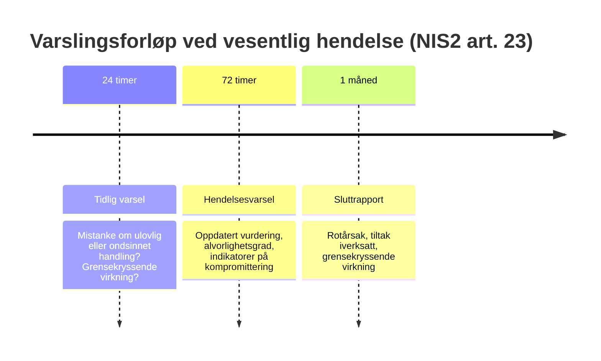

# 06 — NIS2 og digitalsikkerhetsloven: omfangsvurdering

| | |
|---|---|
| **Dokumenteier** | Sikkerhetsansvarlig |
| **Godkjent av** | Daglig leder |
| **Versjon** | 2.0 · Vurdert 01.09.2026 · Revideres ved regelverksendring |
| **Formål** | Vurdere om og hvordan Mjøsdata treffes av NIS2-direktivet ved gjennomføring i norsk rett, og hva det betyr for sikkerhetsprogrammet |
| **Leser videre** | [Tiltaksplan](../02-risikovurdering/tiltaksplan.md) · [Hendelsesresponsplan](../04-isms/hendelsesresponsplan.md) |

---

## 1. Rettslig status per september 2026 — les dette først

Dette er den viktigste presiseringen i dokumentet, og den som oftest gjøres feil i bransjen:

| Regelverk | Status i Norge | Gjelder for Mjøsdata? |
|---|---|---|
| **Digitalsikkerhetsloven** (gjeldende) | I kraft. Gjennomfører **NIS1**. Retter seg mot tilbydere av samfunnsviktige tjenester innen energi, transport, helse, vannforsyning, bank og finansiell infrastruktur, samt enkelte digitale tjenestetilbydere (nettbaserte markedsplasser, søkemotorer, skytjenester) | **Nei** — etter alt å dømme ikke. En MSP av Mjøsdatas type og størrelse er ikke pliktsubjekt |
| **NIS2-direktivet** (EU 2022/2555) | Trådt i kraft i EU. **Ennå ikke innlemmet i EØS-avtalen** og dermed ikke gjennomført i norsk rett. Ny norsk lov er varslet, men tidspunkt er ikke fastsatt | **Ikke ennå** — men sannsynligvis når gjennomføringen kommer, se pkt. 2 |

> **Konsekvens for hele denne porteføljen:** alle henvisninger til NIS2-plikter er **forberedende, ikke gjeldende rett**. Tiltakene begrunnes derfor i risiko og kundekrav — som er reelle i dag — og ikke i en lovplikt som ikke finnes ennå. Det er en vesentlig forskjell for en virksomhet som skal prioritere budsjett.

---

## 2. Hvorfor spørsmålet likevel er relevant nå

NIS2 utvider virkeområdet betydelig sammenlignet med NIS1. **Managed service providers (MSP) og managed security service providers (MSSP)** er tatt inn som egne kategorier under sektoren «IKT-tjenestestyring (business-to-business)» i direktivets vedlegg I. En norsk MSP kan dermed bli **direkte pliktsubjekt** — ikke bare indirekte berørt gjennom kundenes leverandørkrav.

To andre forhold gjør at forberedelse lønner seg uavhengig av lovtidspunktet:

1. **Kundene får kravene først.** Kommuner og helsevirksomheter er selv omfattede sektorer, og NIS2 pålegger dem uttrykkelig å stille sikkerhetskrav til leverandørkjeden. Kravene når Mjøsdata gjennom kontrakt og anskaffelse lenge før de når selskapet gjennom lov.
2. **Beredskap er billig, hastverk er dyrt.** Tiltakene i [kap. 02](../02-risikovurdering/tiltaksplan.md) er begrunnet i risiko uansett; å gjøre dem NIS2-kompatible koster marginalt ekstra nå og vesentlig mer under tidspress senere.

---

## 3. Omfangsvurdering

| Kriterium | Vurdering for Mjøsdata |
|---|---|
| **Tjenestetype** | IT-drift, skyadministrasjon og sikkerhetstjenester = MSP/MSSP-kategorien i vedlegg I. **Treffer** |
| **Størrelseskriterium** | Se den presise vurderingen under. **Uavklart — avhenger av regnskapstall** |
| **Kundeprofil** | Drift for kommuner og helsevirksomheter, som selv er omfattede sektorer. Forsterker både direkte og indirekte eksponering |
| **Sannsynlig klassifisering** | **Viktig virksomhet** («important entity») dersom omfattet |

### 3.1 Størrelseskriteriet — presist

NIS2 art. 2 nr. 1 gjelder virksomheter som kvalifiserer som **mellomstore** etter EU-kommisjonens rekommandasjon 2003/361/EF, eller som overstiger taket for mellomstore. En virksomhet er **ikke** liten — og dermed minst mellomstor — dersom:

- den har **50 ansatte eller flere**, **eller**
- **både** årlig omsetning **og** balansesum overstiger **10 mill. euro**

Med **45 ansatte** er Mjøsdata under bemanningsterskelen. Avgjørelsen beror derfor på om *begge* de finansielle tersklene overskrides samtidig. Det er en strengere test enn «omsetning eller balanse over 10 mill.», som ofte gjengis feil, og forskjellen er avgjørende i akkurat dette grensetilfellet.

**Merk også:** ved beregningen skal eventuelle partnerforetak og tilknyttede foretak konsolideres inn. En MSP som inngår i et konsern kan bli omfattet selv om selve driftsselskapet er lite.

### 3.2 Essential eller important?

For virksomheter i vedlegg I er skillet størrelsesbasert: **store** virksomheter (≥ 250 ansatte, eller omsetning > 50 mill. euro og balanse > 43 mill. euro) blir *vesentlige* virksomheter, mens **mellomstore** blir *viktige* virksomheter. Mjøsdata ville i alle realistiske scenarioer havne i sistnevnte kategori.

Praktisk forskjell: **samme grunnkrav til sikkerhetstiltak**, men tilsyn skjer i etterkant og reaktivt framfor proaktivt, og de øvre gebyrsatsene er lavere. Kravene til risikostyring i art. 21 er derimot identiske — det er ikke en «light-versjon» av regelverket.

### 3.3 Konklusjon

Mjøsdata bør **planlegge som om virksomheten blir omfattet**. Selv i scenarioet der størrelseskriteriet ikke slår inn, vil kommunale og helsekunder videreføre NIS2-krav kontraktuelt. Kostnaden ved å være forberedt er lav; kostnaden ved ikke å være det er tapte anbud — som inntreffer før eventuelle sanksjoner.

Vurderingen skal fornyes ved: ny norsk lov, vekst forbi 50 ansatte, konsernendringer, eller vesentlig endring i kundeporteføljen.

---

## 4. Kravene i art. 21 — gap-analyse mot porteføljen

NIS2 art. 21 nr. 2 krever risikostyringstiltak innen ti områder. Under vises hva som allerede er dekket av dette prosjektets leveranser, og hva som gjenstår:

| # | NIS2-krav (art. 21 nr. 2) | Dekket av | Gjenstående gap |
|:---:|---|---|---|
| a | Risikoanalyse og informasjonssikkerhetspolicyer | [Kap. 02](../02-risikovurdering/metodikk.md) — metodikk, register, behandlingsplan | Formalisere årlig syklus med dokumentert ledelsesgodkjenning |
| b | Hendelseshåndtering | [Hendelsesresponsplan](../04-isms/hendelsesresponsplan.md) | ✅ Varslingsfristene (24 t / 72 t / 1 mnd) er innarbeidet som betinget rad |
| c | Driftskontinuitet, backup og krisehåndtering | [T3](../02-risikovurdering/tiltaksplan.md#t3--geo-redundans-immutable-backup-og-ddos-beskyttelse) — geo-redundans, immutable backup | Dokumentert BCP/DRP med **RTO/RPO per kundekategori** (`A.5.30`, ikke påbegynt) |
| d | Leverandørkjedesikkerhet | [T10](../02-risikovurdering/tiltaksplan.md#t10--leverandør--og-verktøykjedestyring) + art. 28-avtaler i [kap. 03](../03-gdpr/gdpr-analyse.md) | Gjennomføring gjenstår; RMM-verktøy er høyest prioritet |
| e | Sikkerhet i anskaffelse, utvikling og drift | [T7](../02-risikovurdering/tiltaksplan.md#t7--baseline-konfigurasjon-og-teknisk-revisjon-av-azure) — baseline, penetrasjonstest | Sikkerhetskrav som fast del av anskaffelsesrutinen |
| f | Evaluering av tiltakenes effekt | KPI-er i [kap. 05](../05-sikkerhetskultur/opplaeringsprogram.md#5-måling-og-mål); restrisiko i [kap. 02](../02-risikovurdering/tiltaksplan.md#restrisiko-og-formell-aksept) | Samlet årlig effektivitetsgjennomgang (ISO 27001 pkt. 9.3) |
| g | Cyberhygiene og opplæring | [Kap. 05](../05-sikkerhetskultur/opplaeringsprogram.md) | ✅ Dekket |
| h | Kryptografi og kryptering | [T5](../02-risikovurdering/tiltaksplan.md#t5--sikring-av-api-integrasjoner), [T9](../02-risikovurdering/tiltaksplan.md#t9--full-diskkryptering-og-endepunktkontroll), `A.8.24` | Egen **kryptopolicy** med algoritmekrav og nøkkelhåndtering |
| i | Personellsikkerhet, tilgangskontroll og forvaltning av aktiva | [Tilgangsstyringspolicy](../04-isms/policy-tilgangsstyring.md), [T6](../02-risikovurdering/tiltaksplan.md#t6--rollebasert-tilgangsstyring-og-periodisk-tilgangsrevisjon) | Rutine for bakgrunnssjekk ved ansettelse i sikkerhetskritiske roller |
| j | MFA, sikret kommunikasjon og nødkommunikasjon | [T1](../02-risikovurdering/tiltaksplan.md#t1--obligatorisk-phishing-resistent-mfa-og-betinget-tilgang) | Nødkommunikasjonsløsning ved totalt systemtap (delvis dekket av offline kontaktliste) |

**Oppsummert:** 2 av 10 områder er dekket, 8 har identifiserte og prioriterte gap. Ingen av gapene krever ny teknologi — samtlige er dokumentasjons- eller prosessarbeid, og seks av dem er allerede tildelt et tiltak med eier og frist.

---

## 5. Ledelsesansvar

NIS2 art. 20 gjør ledelsen personlig ansvarlig for å godkjenne og følge opp risikostyringstiltakene, og krever at ledelsen selv gjennomgår opplæring i risikostyring. Ved grove overtredelser kan tilsynsmyndigheten midlertidig forby personer i ledende stillinger å utøve lederfunksjoner.

Dette er reflektert i porteføljen allerede: [styringsmodellen](../02-risikovurdering/tiltaksplan.md#styring-og-oppfølging) legger kvartalsvis rapportering til daglig leder og årlig styresak, restrisiko krever [dokumentert aksept fra daglig leder](../02-risikovurdering/tiltaksplan.md#restrisiko-og-formell-aksept), og [opplæringsprogrammet](../05-sikkerhetskultur/opplaeringsprogram.md#2-målgrupper-og-innhold) har en egen ledermodul.

---

## 6. Varslingsplikt

NIS2 innfører **trestegs varsling** til myndigheten ved vesentlige hendelser:

Dette er både strengere og bredere enn GDPR art. 33, som bare gjelder brudd på personopplysningssikkerheten: en driftshendelse uten persondata kan være varslingspliktig etter NIS2 og ikke etter GDPR. Fristene er tatt inn i [varslingsmatrisen](../04-isms/hendelsesresponsplan.md#5-varslingsmatrise) som betinget rad, slik at hendelsesleder ikke må lete etter dem den dagen de blir gjeldende.

---

## 7. Anbefalt handlingsplan

| Når | Tiltak |
|---|---|
| **Løpende** | Følge gjennomføringen av NIS2 i norsk rett; avklare hvilken sektormyndighet som blir tilsynsorgan og om registreringsplikt inntreffer |
| **0–3 mnd** | Lukke gap med lav kostnad: kryptopolicy, BCP/DRP-dokumentasjon med RTO/RPO, sikkerhetskrav i anskaffelsesrutinen |
| **3–6 mnd** | Etablere leverandørrisikoprogram ([T10](../02-risikovurdering/tiltaksplan.md#t10--leverandør--og-verktøykjedestyring)) med særskilt vurdering av fjernstyrings- og RMM-verktøy |
| **6–12 mnd** | Første samlede effektivitetsgjennomgang; ledelsens gjennomgang etter ISO 27001 pkt. 9.3 |
| **Løpende** | Bruke NIS2-beredskapen aktivt i salg mot kommunal- og helsesegmentet — etterlevelse som konkurransefortrinn, ikke bare kostnad |

---

## 8. Kilder

- Direktiv (EU) 2022/2555 (NIS2), særlig art. 2, 20, 21 og 23 samt vedlegg I
- Kommisjonens rekommandasjon 2003/361/EF om definisjonen av SMB-er
- Lov om digital sikkerhet (digitalsikkerhetsloven) — gjennomfører NIS1
- NSM: veiledning om digitalsikkerhetsloven
