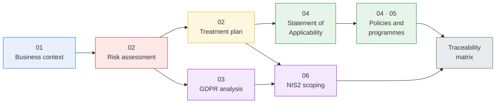

# GRC Portfolio — Security Governance for a Norwegian MSP


A self-directed governance, risk and compliance project built around **Mjøsdata AS**, a fictional Norwegian IT managed service provider (MSP) serving SMBs, health clinics and municipalities in Innlandet.

The project produces the deliverables a junior GRC consultant would hand a real client: business and system context, a formal risk assessment, a GDPR compliance analysis, the core of an ISO 27001-aligned ISMS, a security awareness programme, and a NIS2 scoping analysis — with every control traceable back to the risk that justifies it.

> **Note.** Mjøsdata AS is entirely fictional; all data, systems and findings are constructed for demonstration. Core deliverables are written in **Norwegian**, the working language of the target market. This README summarises each in English. → [Norsk README](README.no.md)

---

## The through-line

Everything in this portfolio follows one chain. Each link is a document, and each document points back to the one before it:



The single insight that shapes the whole portfolio: **an MSP carries its customers' risk simultaneously.** One breach at Mjøsdata is a breach at every customer at once. That is why consequence ratings sit structurally higher than they would for a standalone company of 45 people, why network segmentation gets funded despite being the most expensive measure on the list, why the incident response plan has a dual notification duty, and why NIS2 readiness is treated as a sales asset rather than a cost.

---

## Frameworks and standards — and why each one is here

| Area | Framework | Why this one |
|---|---|---|
| Risk methodology | **ISO/IEC 27005:2022** | The risk-management companion to 27001. Lets the organisation define its own scales — which is the point: criteria are fixed *before* the assessment, so ratings are reproducible rather than retrofitted |
| Security management | **ISO/IEC 27001:2022** | Provides the management-system frame and the Annex A control vocabulary. Also commercially load-bearing: municipal and health customers ask for it in procurement |
| Privacy | **GDPR** / personopplysningsloven, Datatilsynet guidance | An MSP is controller *and* processor at the same time. That double role, and the contract chains it creates in both directions, is the substantive part of chapter 03 |
| Norwegian baseline | **NSM Grunnprinsipper for IKT-sikkerhet 2.1** | What Norwegian public-sector customers and NSM actually expect. Measures are dual-mapped to both ISO and NSM |
| Regulatory horizon | **NIS2** (EU 2022/2555) | NIS2 names managed service providers as their own category. Not yet Norwegian law — see the status note below |
| Awareness | **ENISA** guidance, **SANS** Security Awareness Maturity Model | Chapter 05 is measured against the SANS maturity levels rather than delivered as generic training |

> **Regulatory status, September 2026.** Norway's current *digitalsikkerhetslov* implements **NIS1** and does not cover an MSP of this type. NIS2 has not yet been incorporated into the EEA agreement or implemented in Norwegian law. Every NIS2 obligation referenced in this portfolio is therefore **preparatory, not applicable law** — and is labelled as such throughout. See [chapter 06](06-nis2/nis2-vurdering.md#1-rettslig-status-per-september-2026--les-dette-først).

---

## Repository structure

```
├── 01-virksomhetskontekst/    Business context, digital value chain, stakeholders, scope
├── 02-risikovurdering/        Methodology · risk register · risk treatment plan
├── 03-gdpr/                   Role analysis · article mapping · ROPA extract · DPIA screening
├── 04-isms/                   Statement of Applicability · access control policy
│                              · incident response plan
├── 05-sikkerhetskultur/       Security awareness and behaviour change programme
├── 06-nis2/                   NIS2 / digitalsikkerhetsloven scoping analysis
└── sporbarhetsmatrise.md      Traceability: risk → measure → control → residual risk
```

---

## Deliverables at a glance

| # | Document | What it contains |
|:---:|---|---|
| **01** | [Virksomhetskontekst](01-virksomhetskontekst/virksomhetskontekst.md) | Who Mjøsdata is, the core support process (Salesforce → Jira Service Management → Azure), stakeholder requirements, and why the CIA properties map directly onto commercial promises — SLA uptime, confidentiality of client health and legal data |
| **02** | [Metodikk](02-risikovurdering/metodikk.md) · [Risikoregister](02-risikovurdering/risikoregister.md) · [Tiltaksplan](02-risikovurdering/tiltaksplan.md) | A documented ISO 27005 methodology with explicit scales and acceptance criteria, a 10-item risk register, and ten prioritised measures with residual risk expressed as new S×K pairs and mapped to Annex A |
| **03** | [GDPR-analyse](03-gdpr/gdpr-analyse.md) | Controller vs. processor role analysis (the interesting part for an MSP), article-by-article obligations, an Art. 30 records extract, a DPIA screening for health-clinic data, and a reasoned Art. 37 DPO assessment |
| **04** | [SoA](04-isms/statement-of-applicability.md) · [Tilgangsstyring](04-isms/policy-tilgangsstyring.md) · [Hendelsesrespons](04-isms/hendelsesresponsplan.md) | A Statement of Applicability covering the 36 controls invoked by the treatment plan, with justified exclusions, plus two operational documents — an access control policy and an incident response plan — written to be used, not filed |
| **05** | [Opplæringsprogram](05-sikkerhetskultur/opplaeringsprogram.md) | Risk-driven target-group analysis, curriculum, delivery channels, and a behaviour-change campaign with measurable KPIs benchmarked against the SANS maturity model |
| **06** | [NIS2-vurdering](06-nis2/nis2-vurdering.md) | Whether an MSP with municipal and healthcare customers falls in scope, the precise size test, what "important entity" status would require, and a gap view against what chapters 02 and 04 already deliver |
| **↔** | [Sporbarhetsmatrise](sporbarhetsmatrise.md) | The whole chain in one table, in both directions, plus an honest list of known gaps |

---

## What a reviewer might want to look at first

- **[The traceability matrix](sporbarhetsmatrise.md)** — the fastest way to see whether the portfolio holds together. Every risk has a measure, an owner, a deadline, a control and a residual rating.
- **[The Art. 37 DPO assessment](03-gdpr/gdpr-analyse.md#5-personvernombud-art-37--en-reell-tvil)** — an example of engaging with a genuinely unsettled legal question instead of picking the convenient answer.
- **[The compliance-risk consequence rule](02-risikovurdering/metodikk.md#11-hvordan-konsekvens-fastsettes)** — where the CIA model doesn't fit, the methodology is extended explicitly rather than the numbers being quietly adjusted.
- **[The SoA exclusions](04-isms/statement-of-applicability.md#a7--fysiske-kontroller)** — a SoA without justified "No" entries is a red flag to an auditor.

---

## What I would do next

- Extend the SoA to full 93-control Annex A coverage, with control owners and verification dates
- Add the two remaining ISO 27001 clause-9 pieces: an internal audit programme and a management review procedure
- Write the BCP/DRP with RTO/RPO per customer category, closing `A.5.30` and the largest NIS2 gap
- Build a small compliance gap-analysis tool (CLI) against NSM Grunnprinsipper
- Add a processor-assessment template for Mjøsdata's own subcontractors

---

## Author

Master's student in Information Security (NTNU), B.Sc. Cyber Security (Høyskolen Kristiania). This project generalises and substantially extends coursework into a standalone portfolio piece.

## Licence

Documentation released under [CC BY 4.0](LICENSE) — reuse and adapt with attribution.
