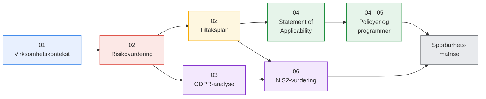

# GRC-portefølje — sikkerhetsstyring for en norsk MSP

Et selvstendig GRC-prosjekt bygget rundt **Mjøsdata AS**, en fiktiv norsk IT-driftsleverandør (MSP) som leverer til små og mellomstore virksomheter, helseklinikker og kommuner i Innlandet.

Prosjektet produserer de leveransene en GRC-konsulent ville levert til en reell kunde: virksomhets- og systemkontekst, en formell risikovurdering, en GDPR-analyse, kjernedokumentene i et ISO 27001-basert styringssystem, et sikkerhetskulturprogram og en NIS2-omfangsvurdering — der hver kontroll kan spores tilbake til risikoen som begrunner den.

> **Merk.** Mjøsdata AS er fiktiv. Alle data, systemer og funn er konstruert for demonstrasjonsformål. → [English README](README.md)

---

## Den røde tråden

Alt i porteføljen følger én kjede. Hvert ledd er et dokument, og hvert dokument peker tilbake på det forrige:

Innsikten som former hele porteføljen: **en MSP bærer kundenes risiko samtidig.** Ett innbrudd hos Mjøsdata er ett innbrudd hos alle kundene på én gang. Det er derfor konsekvensnivåene ligger strukturelt høyere enn for en frittstående virksomhet med 45 ansatte, derfor segmentering prioriteres til tross for høyest kostnad, derfor hendelsesresponsplanen har dobbelt varslingsansvar, og derfor NIS2-beredskap behandles som et salgsargument og ikke bare en kostnad.

---

## Rammeverk og standarder — og hvorfor akkurat disse

| Område | Rammeverk | Begrunnelse |
|---|---|---|
| Risikometodikk | **ISO/IEC 27005:2022** | Risikostandarden som hører til 27001. Lar virksomheten definere egne skalaer — og poenget er nettopp at kriteriene fastsettes *før* analysen, slik at vurderingene er etterprøvbare |
| Sikkerhetsstyring | **ISO/IEC 27001:2022** | Gir styringssystemrammen og kontrollvokabularet i Annex A. Også kommersielt viktig: kommunale og helsekunder etterspør det i anskaffelser |
| Personvern | **GDPR** / personopplysningsloven, Datatilsynets veiledere | En MSP er behandlingsansvarlig *og* databehandler samtidig. Den dobbeltrollen — og de to avtalekjedene den skaper — er kjernen i kap. 03 |
| Norsk basisnivå | **NSM Grunnprinsipper for IKT-sikkerhet 2.1** | Det norske offentlige kunder og NSM faktisk forventer. Tiltakene er dobbeltmappet mot både ISO og NSM |
| Regulatorisk horisont | **NIS2** (EU 2022/2555) | NIS2 navngir MSP-er som egen kategori. Ennå ikke norsk rett — se statusmerknaden under |
| Sikkerhetskultur | **ENISA**-veiledning, **SANS** Security Awareness Maturity Model | Kap. 05 måles mot SANS' modenhetsnivåer framfor å leveres som generisk opplæring |

> **Rettslig status per september 2026.** Gjeldende norsk digitalsikkerhetslov gjennomfører **NIS1** og omfatter ikke en MSP av denne typen. NIS2 er ennå ikke innlemmet i EØS-avtalen eller gjennomført i norsk rett. Alle NIS2-plikter i porteføljen er derfor **forberedende, ikke gjeldende rett**, og er merket slik gjennomgående. Se [kap. 06](06-nis2/nis2-vurdering.md#1-rettslig-status-per-september-2026--les-dette-først).

---

## Innhold

| # | Dokument | Innhold |
|:---:|---|---|
| **01** | [Virksomhetskontekst](01-virksomhetskontekst/virksomhetskontekst.md) | Hvem Mjøsdata er, kjerneprosessen (Salesforce → Jira Service Management → Azure), interessentkrav, og hvorfor KIT-egenskapene tilsvarer konkrete kommersielle forpliktelser |
| **02** | [Metodikk](02-risikovurdering/metodikk.md) · [Risikoregister](02-risikovurdering/risikoregister.md) · [Tiltaksplan](02-risikovurdering/tiltaksplan.md) | Dokumentert ISO 27005-metodikk med eksplisitte skalaer og akseptkriterier, ti risikoer, og ti prioriterte tiltak med restrisiko oppgitt som nye S×K-par |
| **03** | [GDPR-analyse](03-gdpr/gdpr-analyse.md) | Rolleanalyse, artikkelgjennomgang, utdrag av behandlingsprotokoll, DPIA-screening og en begrunnet vurdering av personvernombud etter art. 37 |
| **04** | [SoA](04-isms/statement-of-applicability.md) · [Tilgangsstyring](04-isms/policy-tilgangsstyring.md) · [Hendelsesrespons](04-isms/hendelsesresponsplan.md) | Erklæring om anvendelighet for de 36 kontrollene tiltaksplanen påberoper, med begrunnede ekskluderinger, samt to operative dokumenter skrevet for å brukes |
| **05** | [Opplæringsprogram](05-sikkerhetskultur/opplaeringsprogram.md) | Risikodrevet målgruppeanalyse, innhold, kanaler og en atferdskampanje med målbare KPI-er |
| **06** | [NIS2-vurdering](06-nis2/nis2-vurdering.md) | Om en MSP med kommunale og helsekunder omfattes, det presise størrelseskriteriet, hva «viktig virksomhet» innebærer, og gap-analyse mot art. 21 |
| **↔** | [Sporbarhetsmatrise](sporbarhetsmatrise.md) | Hele kjeden i én tabell, begge veier, med en ærlig liste over kjente gap |

---

## Videre arbeid

- Utvide SoA til full dekning av alle 93 kontroller, med kontrolleier og verifiseringsdato
- Legge til internrevisjonsprogram og prosedyre for ledelsens gjennomgang (ISO 27001 pkt. 9.2 og 9.3)
- Utarbeide BCP/DRP med RTO/RPO per kundekategori — lukker `A.5.30` og det største NIS2-gapet
- Bygge et lite gap-analyseverktøy (CLI) mot NSM Grunnprinsipper
- Lage en vurderingsmal for Mjøsdatas egne underleverandører

---

## Forfatter

Masterstudent i informasjonssikkerhet (NTNU), bachelor i cybersikkerhet (Høyskolen Kristiania). Prosjektet generaliserer og videreutvikler emnearbeid til en selvstendig arbeidsprøve.

## Lisens

Dokumentasjonen er utgitt under [CC BY 4.0](LICENSE) — gjenbruk og tilpasning med kreditering.
